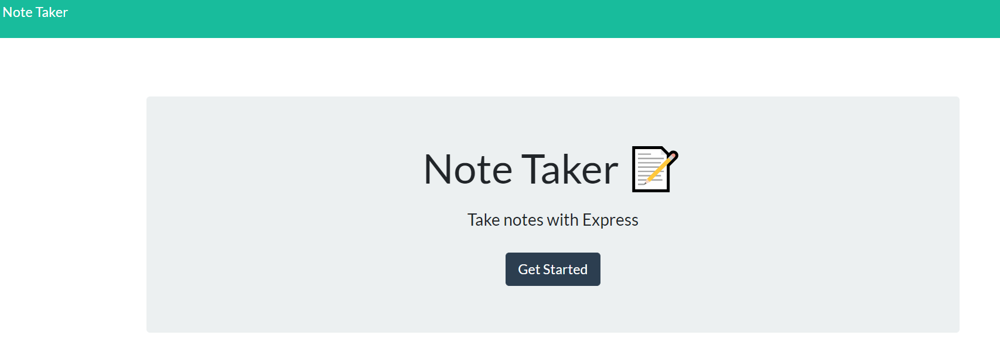

# Note-Taker

An application called Note Taker that can be used to write and save notes. This application will use an Express.js back end and will save and retrieve note data from a JSON file.

# Desciption

The front end aspects of this application were provided. In order to call these attributes, I utilized a get request. I began by running a npm i; installing the necessary package.json. From there, express, path, fs, and uuid were used. UUID was used to give each user note input a unique id. FS was used to write the user note unput to the file. Path was used in conjunction with the get requests. Express was used on the server routes.

 The initial get app requests weren't too complicated to configure. The biggest hurdle was providing the correct file paths. The app get, post, and (bonus delete) paths were sufficiently more difficult for me. A lot of the noteInput functionality seemed redundant, but overall it worked. I also struggled to remember to start and stop my server.  

